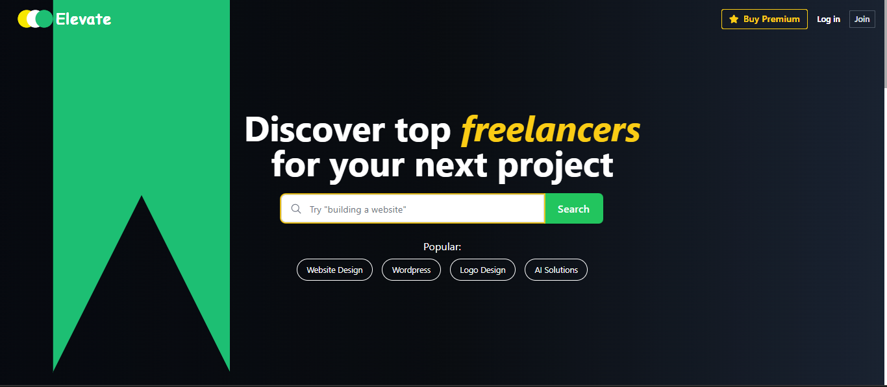
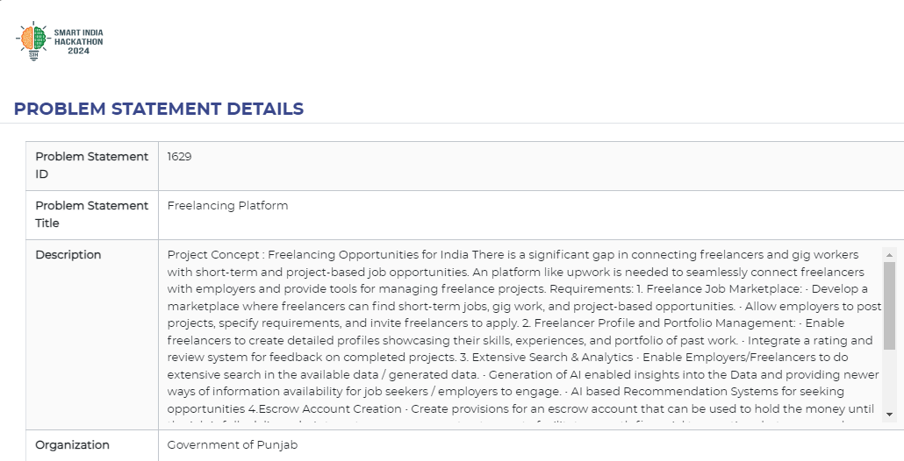
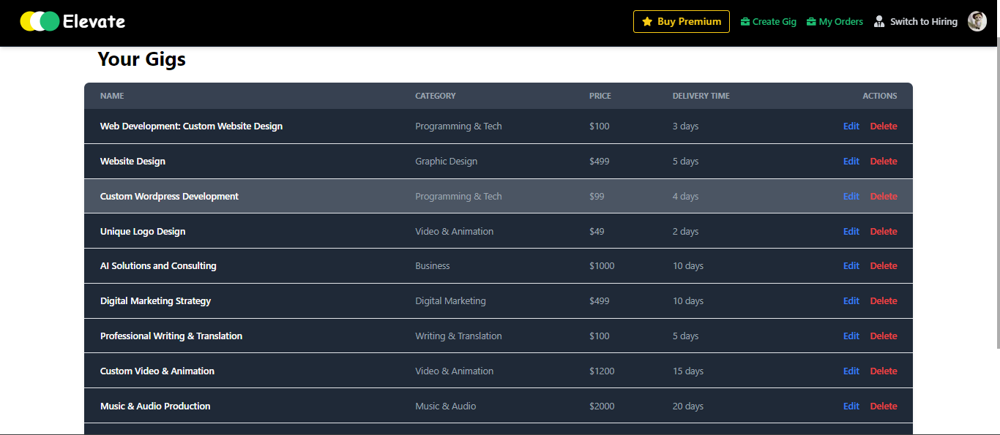
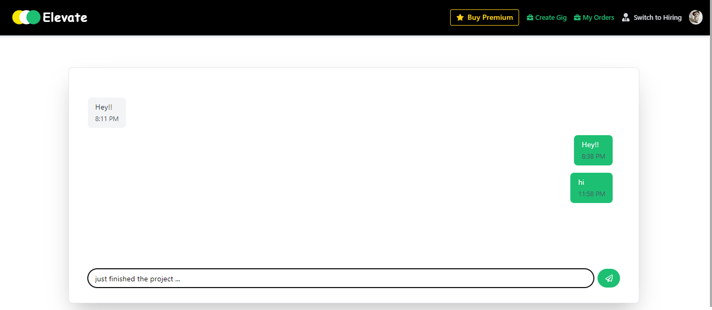
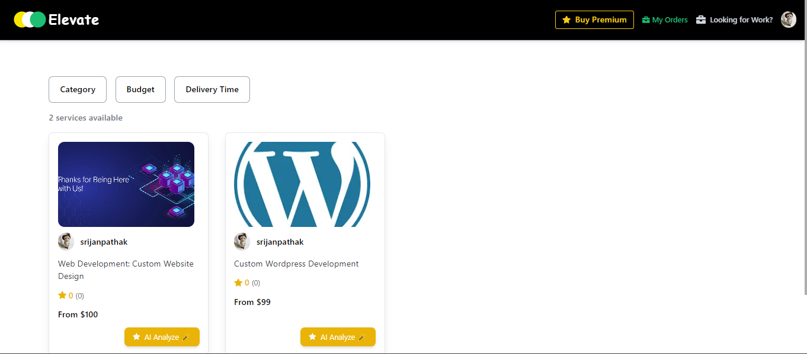
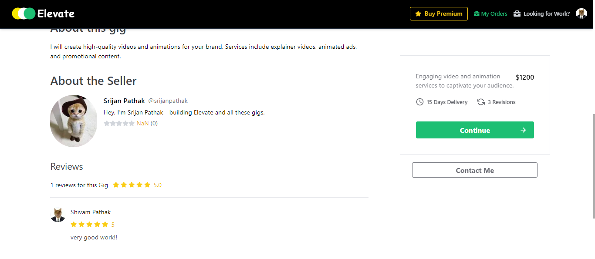

# ELEVATE | Freelancing Platform

Welcome to **ELEVATE**, a freelancing platform developed for the **Smart India Hackathon 2024 (SIH)**. This platform connects freelancers with short-term and project-based opportunities, offering powerful tools for gig management and AI-driven recommendations.



## 🚀 Features
- **Gig Management System**: Built using **Next.js** and **Express.js**, allowing users to create, edit, and manage freelance gigs seamlessly.
- **AI-Powered Gig Analysis**: Developed an AI-based system that evaluates gig quality based on descriptions, pricing, and reviews. Helps over 100 gigs per month with smart recommendations.
- **In-app Chat**: Real-time messaging with support for up to 2,000 messages daily using **React.js**.
- **Secure Payments**: Integrated **Stripe** for escrow-like payment handling, ensuring safe and transparent transactions.
  
## 🛠️ Tech Stack
- **Frontend**: Next.js, React.js, Tailwind CSS
- **Backend**: Node.js, Express.js, PostgreSQL, Prisma
- **Payments**: Stripe
- **AI**: OpenAI API

## 🎯 Hackathon Problem Statement


This project was developed as part of the **Hackathon** for the theme of **Smart Education**, focused on solving real-world freelancing challenges.

## 📸 Screenshots & Functionalities

### 1. Gig Management System

- Create, edit, and manage freelance gigs with ease using the intuitive interface.

### 2. Real-time Messaging

- Seamless chat between freelancers and clients, supporting up to 2,000 messages daily.

### 3. AI-Powered Gig Analysis

- Analyze and receive suggestions on gig quality based on pricing and reviews, powered by AI.

### 4. Gig Reviews

- Users can leave and read reviews for gigs, helping to build trust and improve the quality of freelance services. The review system provides valuable feedback for both freelancers and clients.


## ⚙️ Installation & Setup

1. **Clone the repository**
   ```bash
   git clone https://github.com/srijanpathak03/Elevate.git
   cd Elevate

2. **Install dependencies**
    ```bash
    yarn install
    ```

3. **Setup Prisma**
    ```bash
    npx prisma generate
    npx prisma migrate dev
    ```

4. **Environment Variables**

Create a .env file in the server directory and add your environment variables:
    ```
    DATABASE_URL=your_postgres_url
    STRIPE_SECRET_KEY=your_stripe_key
    OPENAI_API_KEY=your_api_key
    ```
    
5. **Run the development server**

    ```bash
    cd server
    yarn run dev
    ```
6. **Run the NextJS server**

    ```bash
    cd client
    yarn run dev
    ```
## 🤝 Contributing

We welcome contributions to **ELEVATE**! If you’d like to contribute, feel free to fork the repository and submit a pull request. You can also open issues for suggestions, feature requests, or bugs.

1. **Fork the repository**
2. **Create a new branch**
   ```bash
   git checkout -b feature-branch
   ```
3. **Make your changes**
  
4. **Commit your changes**
    ```bash
    git commit -m "Describe your changes"
    ```
5. **Push to the branch and open a PR**
    ```bash
    git push origin feature-branch
    ```  

   
We appreciate your contributions to improve the platform! ❤️
